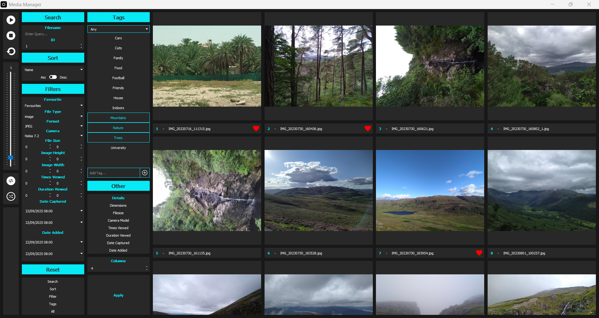

# Image Library App

A desktop application built with Python and PyQt5 for managing and browsing images and videos.

This project was intended to:
- Fulfil the personal need for a slideshow application for family photos.
- Be a way to practise GUI design, system architecture and repository management.
- Learn a Python GUI framework, in this case PyQt5.

## Sample

## Features

- Image loading and viewing
- Image searching
- Metadata-based filter and sort systems
- Tag-based filtering
- Data persistence using SQLite
- Slideshow of selected images

## Tech Stack

- Python 3.11.9
- PyQt5 - GUI framework
- Pillow (PIL) - image processing  
- SQLite 3 - database interactions
- Various Python standard libraries

## Project Structure

image-library-app/
├── components/			 # custom PyQt widget definitions
│   ├── __init__.py     # makes 'components' a python package
│   ├── Gallery.py
│   ├── InputWidgets.py
│   ├── MediaBar.py
│   ├── Sidebar.py
│   ├── Slideshow.py
│   ├── StyledWidgets.py
│   ├── TagList.py
│   ├── Window.py
│   ├── Database.py	 # database interaction code
├── media/              # sample images/videos
├── style.qss           # visual styling
├── database.db         # SQLite database
├── main.py             # main entry point

## Roadmap

- Image thumbnails for faster loading times
- Remove gallery size cap
- Improved error logging
- Responsiveness to screen sizes
- Video playing subsystem

## Known Issues

- UI still appears to freeze when loading large amounts of data
- Adding a tag sometimes crashes the system

## License

MIT License - feel free to use and adapt.

## Extra

Built as a learning project during my university break. Development is ongoing, with planned future improvements.
